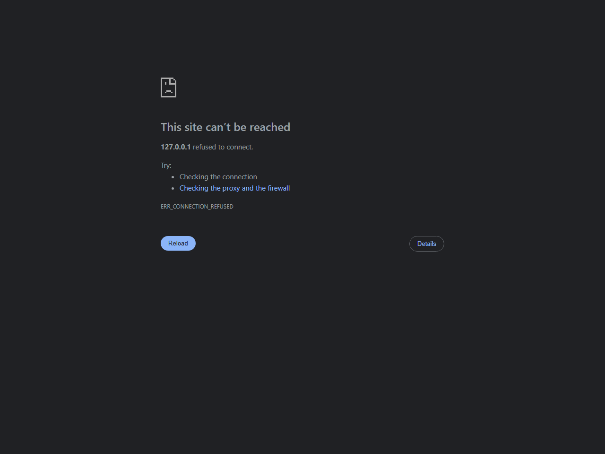
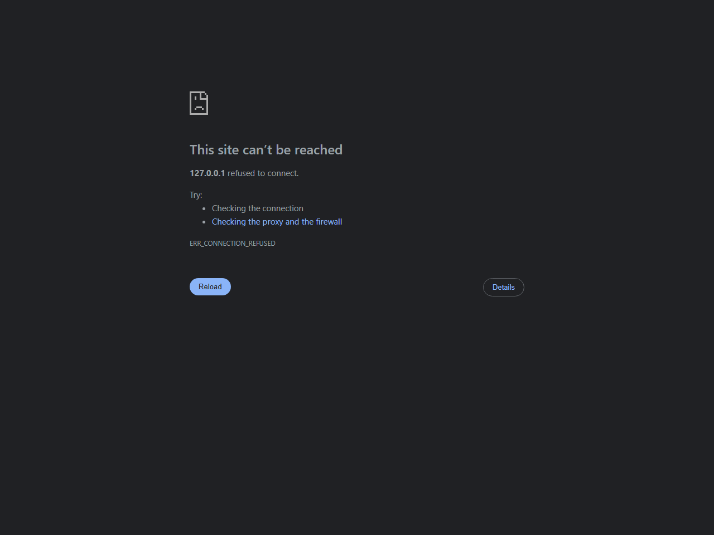
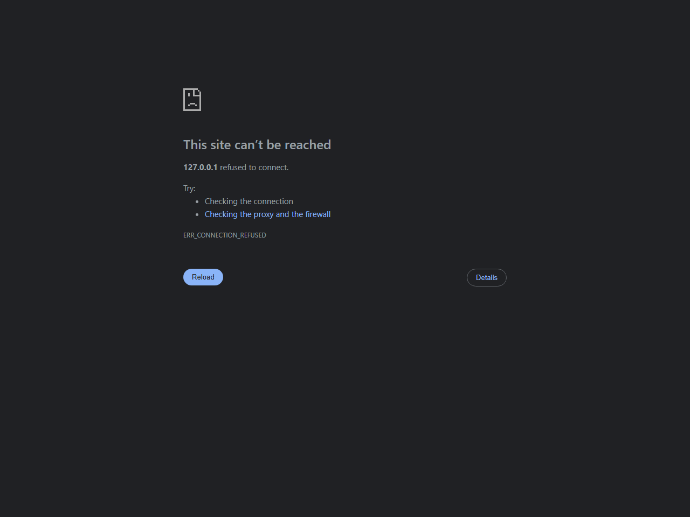
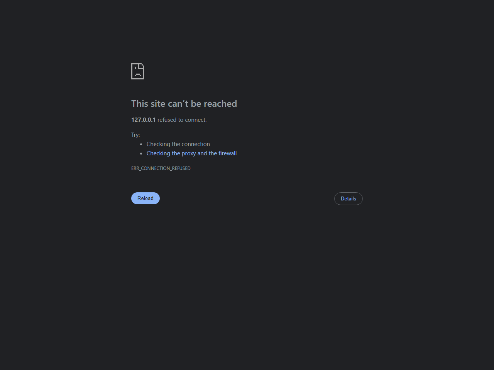
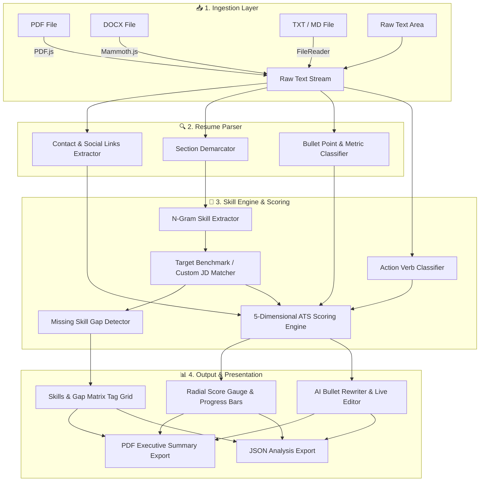

# 📄 AI Resume Analyzer — Pro ATS Score & Skill Gap Optimizer


A high-performance, **100% client-side AI Resume Analyzer** designed to optimize resumes for Applicant Tracking Systems (ATS). Upload PDF, DOCX, or plain text resumes to receive instant 5-dimensional ATS scoring, skill gap detection, custom Job Description matching, and metric-driven bullet point rewrites.

---

## 📸 Actual Project Screenshots (White Theme)

> [!NOTE]  
> All screenshots below are taken directly from the running web application in **White Theme mode**.

### 1. File Upload & Target Job Benchmark Selector
Upload resumes via drag-and-drop or select from pre-loaded industry sample profiles (Senior Full Stack, Mid Developer, Data Scientist).


### 2. Radial ATS Score Gauge & 5-Dimensional Breakdown
Visualizes overall ATS readiness along with multi-category breakdown bars (Skill Alignment, Metric Impact, Section Completeness, Action Verbs, and Contact Info).


### 3. Skill Extraction & Missing Skills Gap Matrix
Compares extracted candidate skills against target role benchmarks or pasted Job Descriptions to highlight matched skills, missing skills, and bonus competencies.


### 4. Action Verb Bullet Rewriter & Live Interactive Editor
Weak bullet points are automatically upgraded with action-oriented phrasing and quantifiable placeholders. Edit your resume live and see real-time score updates.


---

## 🏗️ Architecture & Processing Pipeline

The entire analysis pipeline executes locally in the browser with **zero data transmitted to external servers**, guaranteeing complete privacy.



---

## ✨ Key Features

- **🚀 100% Client-Side Privacy**: No file uploads to cloud servers. PDF/DOCX parsing occurs inside the browser using `PDF.js` and `Mammoth.js`.
- **📊 5-Dimensional ATS Scoring**:
  1. **Skill Alignment Score (35%)**: Evaluates core and secondary skill coverage against role benchmarks.
  2. **Impact & Metrics Score (25%)**: Detects quantitative percentages, dollar figures, and metrics in bullet points.
  3. **ATS Formatting & Sections (15%)**: Ensures standard headings (Experience, Education, Skills, Projects).
  4. **Action Verb Strength (15%)**: Flags passive language and highlights strong leadership verbs (e.g., *Spearheaded*, *Architected*, *Engineered*).
  5. **Contact Completeness (10%)**: Checks for Email, Phone, LinkedIn, and GitHub profiles.
- **🎨 Modern White Theme UI**: Crisp, high-contrast, accessible typography using Inter and Outfit design systems.
- **⚡ 1-Click Sample Resumes**: Instant testing with built-in Senior Full Stack, Mid Developer, and Data Scientist profiles.
- **✍️ Bullet Rewriter & Live Rescoring**: Real-time editor with instantaneous ATS score updates.
- **📥 PDF & JSON Exports**: Export structured JSON data or print-friendly PDF executive summaries.

---

## 🛠️ Technology Stack

- **Frontend**: Vanilla HTML5, JavaScript (ES6 Modules)
- **Styling**: HSL Design Token System in Vanilla CSS3 (Clean Light/White Theme)
- **Document Parsers**: [PDF.js](https://mozilla.github.io/pdf.js/) & [Mammoth.js](https://github.com/mwilliamson/mammoth.js)
- **Typography**: Google Fonts (Outfit & Inter)

---

## 📁 File Structure

```
resume analyzer/
├── index.html              # Main HTML structure with White Theme default
├── styles.css              # Glassmorphic White/Dark Theme CSS system
├── docs/
│   └── images/             # Actual project screenshots
│       ├── 01_hero_upload.png
│       ├── 02_score_breakdown.png
│       ├── 03_skills_matrix.png
│       └── 04_bullet_rewriter.png
├── js/
│   ├── app.js              # Application entry point & file loaders
│   ├── analyzer.js         # 5-Dimensional ATS scoring engine & recommendations
│   ├── parser.js           # Client-side PDF/DOCX text & section parser
│   ├── skillDb.js          # Industry skill taxonomy & job benchmarks
│   └── ui.js               # DOM controller, score gauges & tab routing
└── samples/
    └── sample_resumes.js   # Pre-loaded benchmark resumes
```

---

## 🚀 Quick Start

1. **Clone the repository**:
   ```bash
   git clone https://github.com/your-username/resume-analyzer.git
   cd resume-analyzer
   ```

2. **Run locally**:
   Simply open `index.html` in any modern web browser (Chrome, Edge, Firefox, Safari):
   ```bash
   # On macOS
   open index.html

   # On Windows
   start index.html

   # Or run via local static server
   npx serve .
   ```

---

## 🤝 Contributing

Contributions are welcome! Feel free to open an issue or submit a pull request:
1. Fork the Project
2. Create your Feature Branch (`git checkout -b feature/AmazingFeature`)
3. Commit your Changes (`git commit -m 'Add some AmazingFeature'`)
4. Push to the Branch (`git push origin feature/AmazingFeature`)
5. Open a Pull Request

---

## 📜 License

Distributed under the MIT License. See `LICENSE` for more information.
